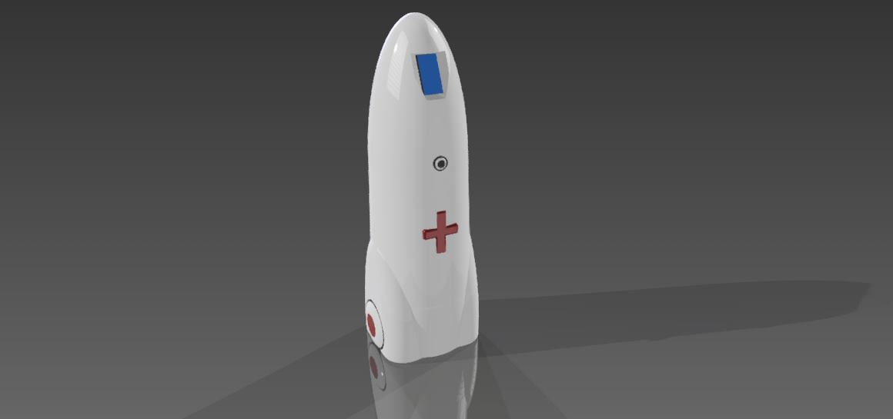

# Peter Moss COVID-19 AI Research Project
## Emergency Assistance Robot

    

&nbsp;

# Table Of Contents

- [Introduction](#introduction)
- [Open Technology](#open-technology)
- [Key Features](#key-features)
- [Assistance Features](#assistance-features)
- [Contributing](#contributing)
    - [Contributors](#contributors)
- [Versioning](#versioning)
- [License](#license)
- [Bugs/Issues](#bugs-issues)

&nbsp;

# Introduction

  
**DESIGN CREDIT:** [Simeon Pieterkosky](https://www.leukemiaresearchassociation.ai/team/simeon-pieterkosky "Simeon Pieterkosky")

**EMAR** is an open-source, tele-operated Emergency Assistance Robot, designed to reduce the amount of exposure medical staff have with patients and potential patients during pandemics and similar situations we may face in the future. 

The idea for this open-source tele-operated robot came as I was sat in room in a hospital surrounded by people with COVID-19 as a potential COVID-19 Pneumonia patient. The doctors, nurses and other teams were in among us for the whole 12 hours or more I was in the hospital.

Some of the common things I saw was nurses & doctors calling patients, giving paracetamol, taking temperatures, adjusting masks and blankets. Every time one of the medical staff had to do one of these tasks they were putting themselves in danger of catching COVID-19.

Each of these tasks can be carried out by tele-operated robots, and this is what we are building EMAR for.    

__This project is a work in progress, however our plan is to work with a local medical/health center or hospital to do a pilot project.__

&nbsp;

# Open Technology
- **Open Software** 
    - EMAR's software is entirely open-source.
- **Open STLS** 
    - The STL files required to print EMAR are open-source.

&nbsp;

# Key Features

- **HIAS Network Device**
    - EMAR is a device on the HIAS network, allowing machine to machine/machine to application communication.
- **HIAS UI Plugin**
    - Integration with the HIAS UI.
- **3D printed**
    - EMAR's shell is 3D printed.
- **Tele-Operated** 
    - Remotely operated using the HIAS UI & voice control.
- **Object detection** 
    - Object detection adds an extra layer of awareness, assisting medical staff as they maneuver the robot.
- **Proximity Sensors** 
    - Proximity detection adds an extra layer of awareness, assisting medical staff as they maneuver the robot.

&nbsp;

# Assistance Features
- **Temperature Reading** 
    - Able to take temperatures of patients.
- **Adjusting Blankets** 
    - Able to adjust blankets on patients.
- **Adjusting Breathing Apparatus** 
    - Able to adjust beathing apparatus on patients.
- **Two way audio streaming** 
    - Two way audio streaming allows medical staff and patients to communicate.

&nbsp;

# Contributing

The Peter Moss Acute Myeloid & Lymphoblastic Leukemia AI Research project encourages and welcomes code contributions, bug fixes and enhancements from the Github.

Please read the [CONTRIBUTING](CONTRIBUTING.md "CONTRIBUTING") document for a full guide to forking our repositories and submitting your pull requests. You will also find information about our code of conduct on this page.

## Contributors

- [Adam Milton-Barker](https://www.leukemiaresearchassociation.ai/team/adam-milton-barker "Adam Milton-Barker") - [Asociacion De Investigation En Inteligencia Artificial Para La Leucemia Peter Moss](https://www.leukemiaresearchassociation.ai "Asociacion De Investigation En Inteligencia Artificial Para La Leucemia Peter Moss") President & Lead Developer, Sabadell, Spain

- [Simeon Pieterkosky](https://www.leukemiaresearchassociation.ai/team/simeon-pieterkosky "Simeon Pieterkosky") - [Asociacion De Investigation En Inteligencia Artificial Para La Leucemia Peter Moss](https://www.leukemiaresearchassociation.ai "Asociacion De Investigation En Inteligencia Artificial Para La Leucemia Peter Moss") EMAR Product Designer, Norway

- [Rahul Gupta](https://www.leukemiaresearchassociation.ai/team/rahul-gupta "Rahul Gupta") - [Asociacion De Investigation En Inteligencia Artificial Para La Leucemia Peter Moss](https://www.leukemiaresearchassociation.ai "Asociacion De Investigation En Inteligencia Artificial Para La Leucemia Peter Moss") Robotics Engineering & R&D, Gurgaon, India

- [Utkrisht Sharma](https://www.leukemiaresearchassociation.ai/team/utkrisht-sharma "Utkrisht Sharma") - [Asociacion De Investigation En Inteligencia Artificial Para La Leucemia Peter Moss](https://www.leukemiaresearchassociation.ai "Asociacion De Investigation En Inteligencia Artificial Para La Leucemia Peter Moss") Robotics Engineering & R&D, Delhi, India

&nbsp;

# Versioning

We use SemVer for versioning. For the versions available, see [Releases](releases "Releases").

&nbsp;

# License

This project is licensed under the **MIT License** - see the [LICENSE](LICENSE "LICENSE") file for details.

&nbsp;

# Bugs/Issues

We use the [repo issues](issues "repo issues") to track bugs and general requests related to using this project. See [CONTRIBUTING](CONTRIBUTING.md "CONTRIBUTING") for more info on how to submit bugs, feature requests and proposals.